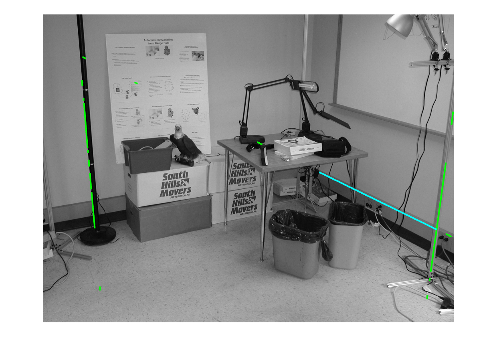
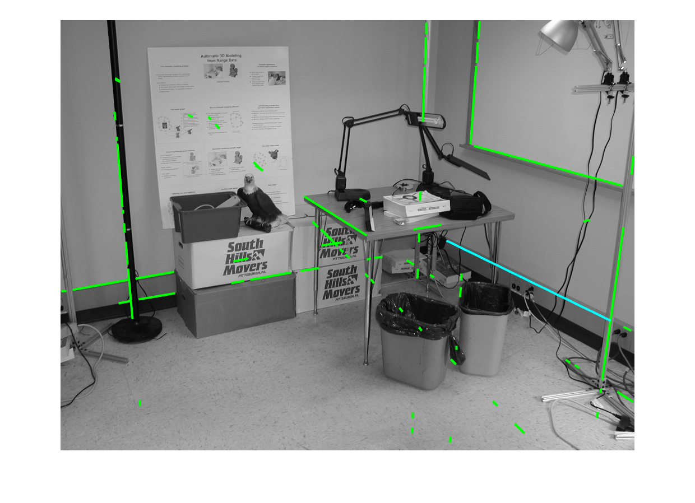
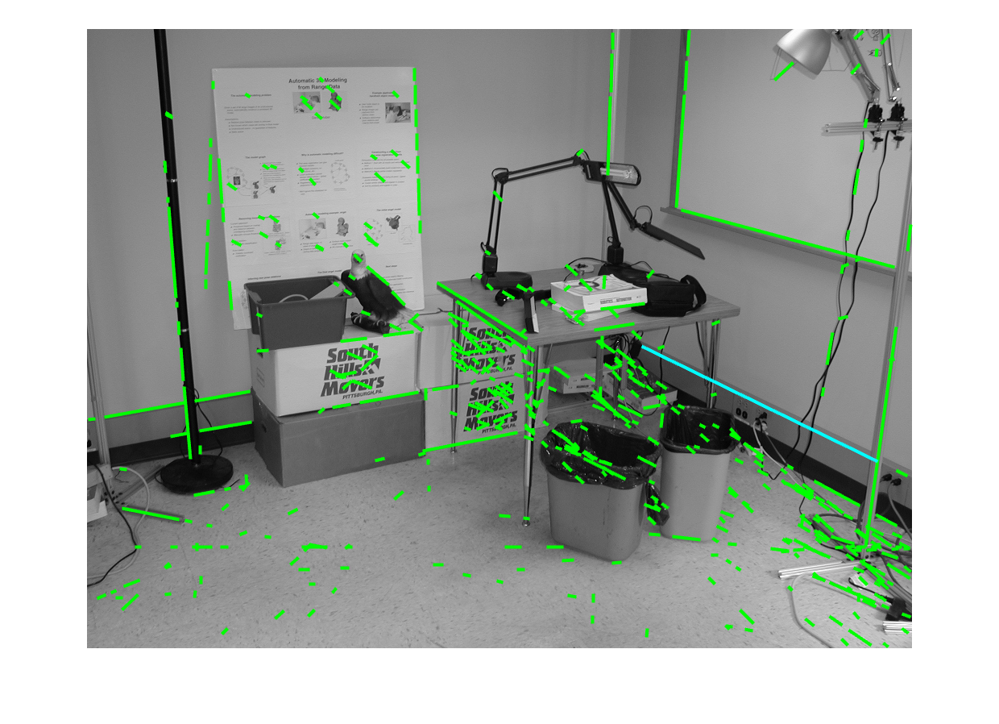
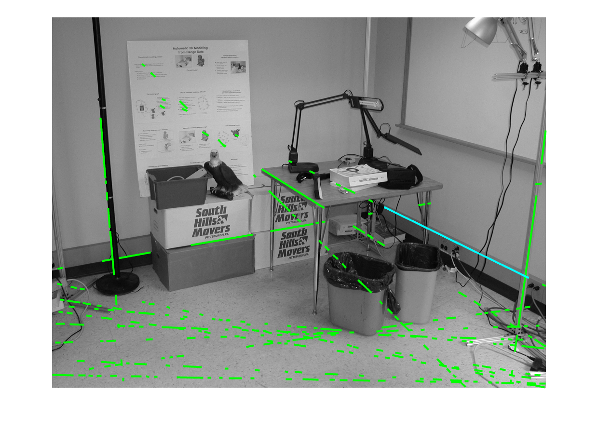
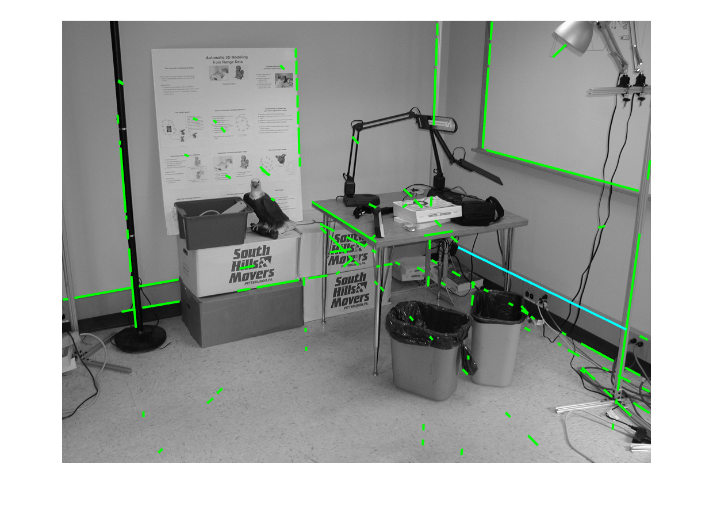
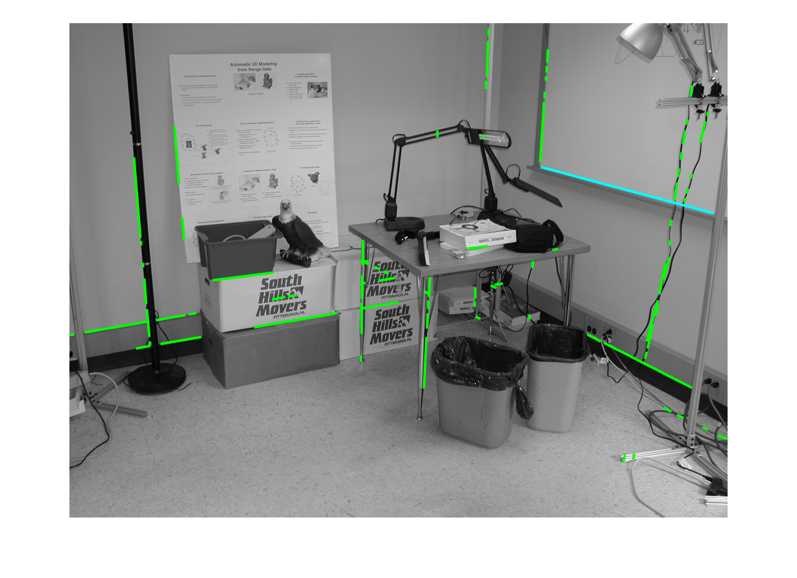
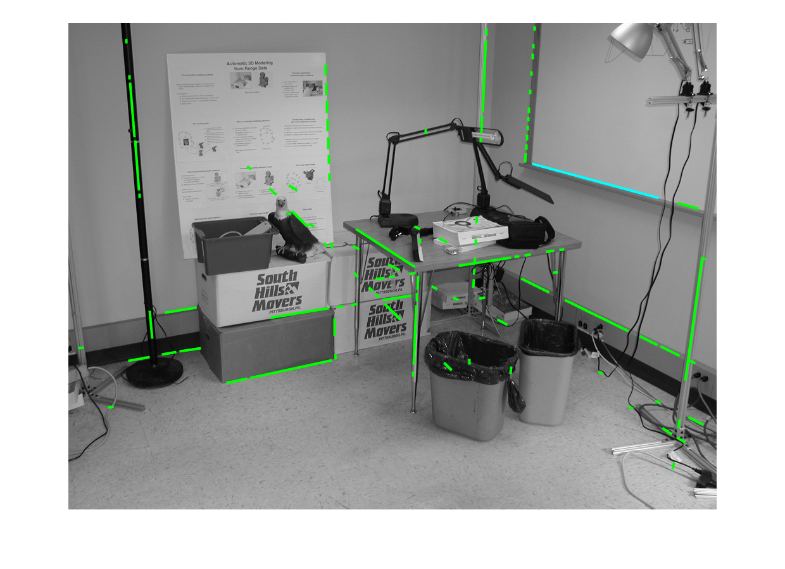
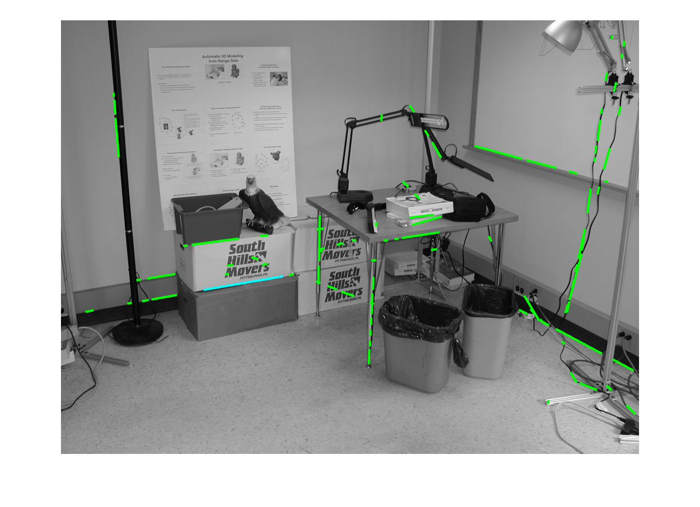

<link type="text/css" rel="stylesheet" href="https://github.com/sugaE/sugaE.github.io/blob/master/uob/md.css">

# Robot Vision - Lab 3 - Hough Transformation
> Yanrong~Wang, 2257486, Robot Vision[06-25024], 2022. [Code is here](https://github.com/sugaE/RV22/tree/main/Lab3).

<!-- ## STEP 1:
• Download the zip file and extract the .m script file and the data files (.jpg) for Lab from CANVAS and save them in your working directory
• Use the matlab script Lab3.m, which has all the steps needed for line detection. -->
## TASK 1:
> Work your way through the script file. Using the help function, understand how each function works, from edge detection, Hough Transform and line detection. Write a summary of how this algorithm works, particularly when finding the start/finish of a line.

We first perform a `canny`(or any other methods) edge detection to get the edge image using `BW = edge(I,'canny');`.

Then feed the edge image to `[H,T,R] = hough(BW);` to calculate hough transform. It is crutial to do the edge detection first.

Use `houghpeaks` to get first few peaks in `H` and `houghlines` to get final detected lines.

The result lines consists `4` properties: starting point, end point, theta and rho. Use these properties combining with previous results, we can draw lines onto the original image and see the results.

## TASK 2:
> What is the effect of increasing/decreasing the required number of peaks in ‘houghpeaks’? This is the second input variable on line 31 of Lab3.m

By decreasing the required number of peaks in `houghpeaks`, only longer lines will remain. If the number is 1, then the result will be the longest line detected.

By increasing the number, shorter lines will appear in the results. And while we will have more lines as we expected, some other noises are also introduced. As shown below, some textures may also be identified as lines. Also the time increases as the number gets larger.

We want to find a proper number so we can detect desired features/lines and also avoid noises.

<!--

 -->
*From left to right, the number of peaks is 3, 10, 50 respectively.*

## TASK 3:
> Replace the Canny Edge detector with other algorithms. Which one do you think performs best and why?

As shown below, with same parameters, `canny` detects the longest and more lines while has some noises on the floor.

`log` produces more structural lines and has less noises.
It is because the `log` method dose a gaussian blur to even out the noises first.

Other methods have similar outputs.

<!-- 

 -->

|             | lines | maxlen            |  notes     |
|-------------|-------|-------------------|-------|
| approxcanny | 285   | 334.0793318958837 | noisy, detects textures on floor |
| canny       | 121   | 326.033740585235  |       |
| sobel       | 81    | 278.469028798536  |       |
| prewitt     | 84    | 278.469028798536  |       |
| zerocross / log   | 103   | 207.1617725353788 |       |
| roberts     | 87    | 143.027969292723  |  detects too few lines     |

