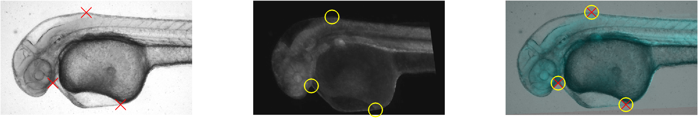
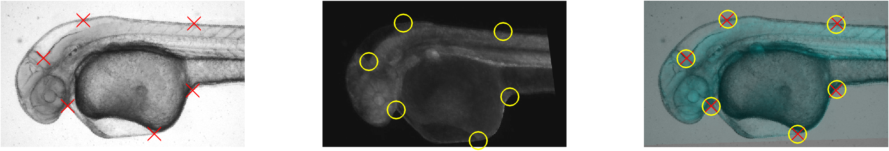
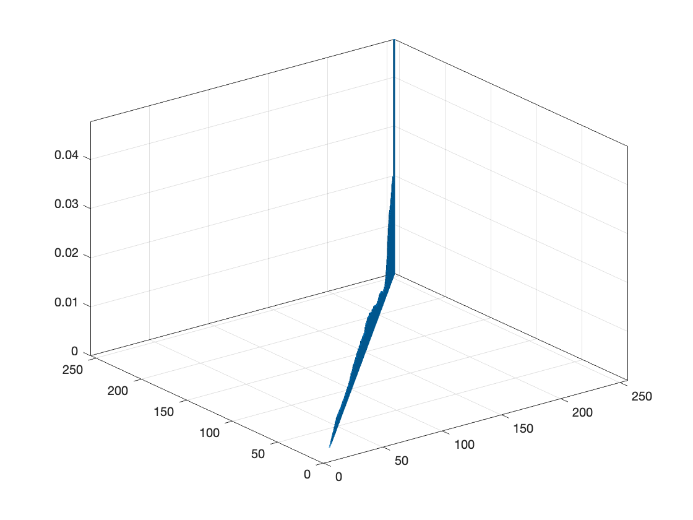
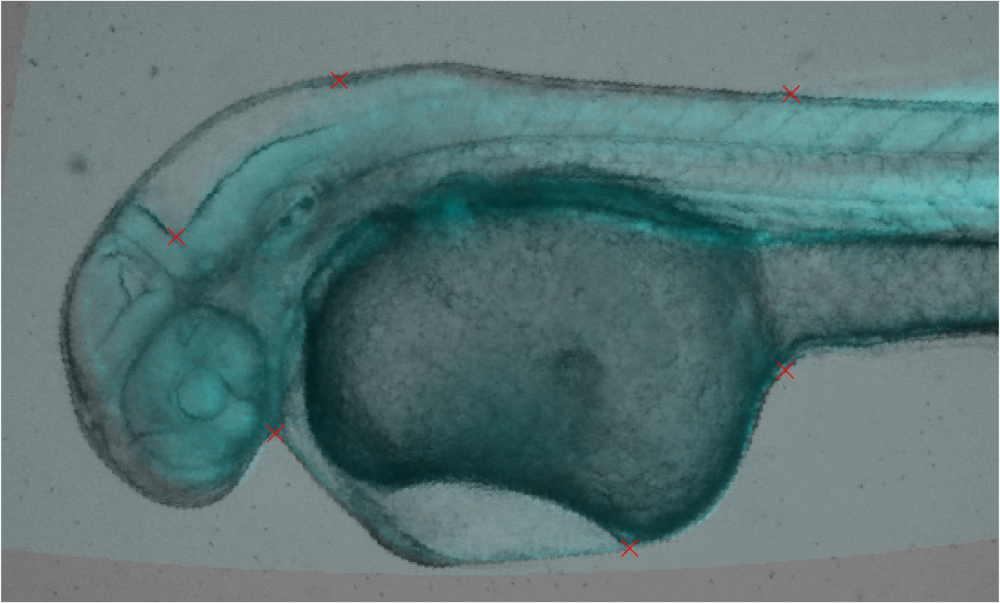
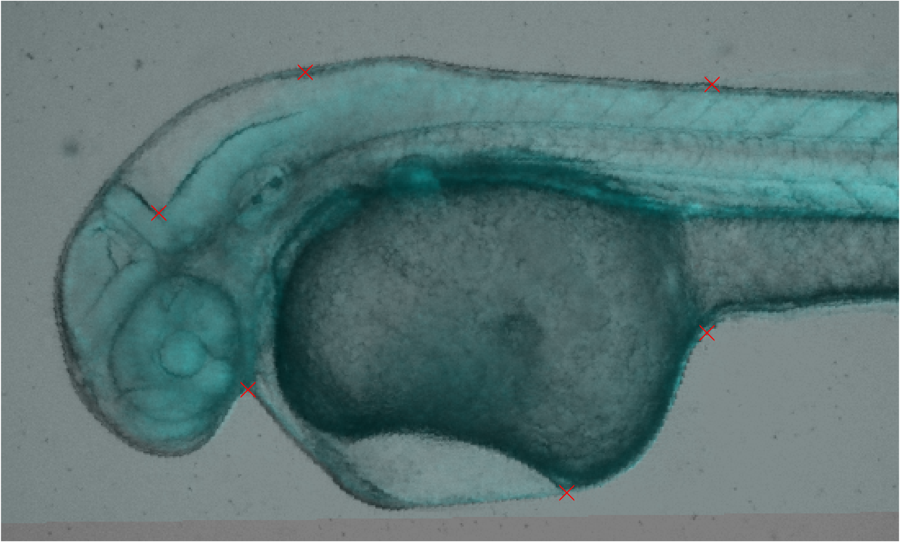
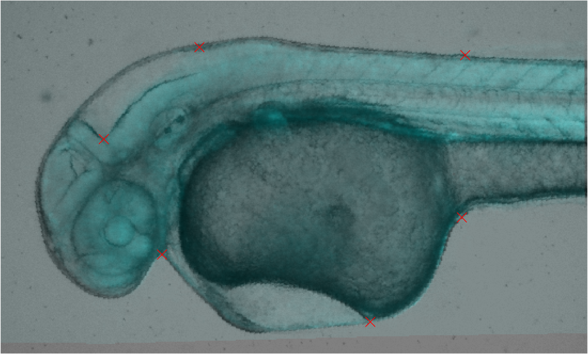
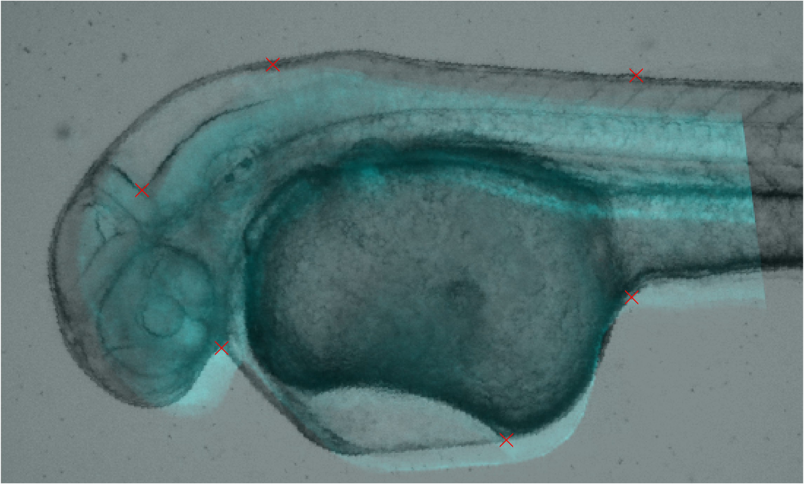

<link type="text/css" rel="stylesheet" href="https://github.com/sugaE/sugaE.github.io/blob/master/uob/md.css">

# Robot Vision - Lab 4 - Registration
> Yanrong~Wang, 2257486, Robot Vision[06-25024], 2022. [Code is here](https://github.com/sugaE/RV22/tree/main/Lab4).

<!-- ## STEP 1:
• Download the zip file and extract the .m script file and the data files (.jpg) for Lab from CANVAS and save them in your working directory
• Use the matlab script Lab3.m, which has all the steps needed for line detection. -->
## Question 1:
> What is the effect of increasing/decreasing the number of chosen control points in registration accuracy?

The more *correct* paired points, the more accurate the transform gets. Also if points are in positions where there are distrinct(good) features (eg. corners), the more accurate the transform gets and less points needed.


| num of control points| time |
|-|-|
|3| 0.210487 s |
|6| 0.083026 s |






```matlab
vis = imread("FishImageFiles/fish-vis.tif");
cfp0 = imread("FishImageFiles/fish-cfp-1.tif");
cfp1 = rgb2gray(cfp0);
% control points
[mp,fp] = cpselect(cfp1,vis,'Wait',true);
t = fitgeotrans(mp,fp,'affine');
Rfixed = imref2d(size(vis));
registered_cfp = imwarp(cfp1,t,'OutputView',Rfixed);
imshowpair(vis,registered_cfp,'blend');
```

## Question 2:
> How would you evaluate the accuracy of your registration?

Use Mutual Information to determine the similarity of 2 images.
$
MI(I,J|T) = \sum_{i,j} p_{i,j}log(\frac{p_{i,j}}{p_ip_j})
$

```matlab
function mi = mutual_info(vis, cfp)

figure;
binlimit=[0, 256];
h_vis = histogram(vis, Normalization="probability", BinLimits=binlimit, BinWidth=1);
hvis_val=h_vis.Values;

h_cfp = histogram(cfp, Normalization="probability", BinLimits=binlimit, BinWidth=1);
hcfp_val=h_cfp.Values;

h2 = histogram2(vis,cfp, Normalization="probability", XBinLimits=binlimit,YBinLimits=binlimit, BinWidth=[1 1]);
h2_val=h2.Values;

mis = zeros(size(h2_val));
for i=1:255
    for j=1:255
        vis_i = vis(i, j)+1;
        cfp_i = cfp(i, j)+1;
        pipj = hvis_val(vis_i) * hcfp_val(cfp_i);
        pij = h2_val(vis_i,cfp_i);
        mis(i,j) = pij * log(pij/pipj);
    end
end
mi = nansum(mis(:));

end
```


## Question 3:
> Other than Affine, what are the other options and which one do you think works best?

(Some options has minimal control points requirement.)

Use mutual information introduced in Q2 to calculate each transform options. Results are as follows. The best score is after `projective` transformation.

|name|extra params|MI|aligned img|
|---|---|---|---|
original||2.0720e+03|
affine||162.6736| 
lwm|6|162.6736| 
nonreflectivesimilarity||126.5719| 
polynomial|2|162.6736| 
**projective**||**170.0860**| 
pwl||169.8911| 

<!-- unregistered||178.8441| -->


<!--


*affine / lwm(6)*


*nonreflectivesimilarity / polynomial(2)*


*projective / pwl* -->


<script type="text/javascript" src="https://cdn.mathjax.org/mathjax/latest/MathJax.js?config=TeX-AMS-MML_HTMLorMML"></script>
<script type="text/x-mathjax-config">
    MathJax.Hub.Config({ tex2jax: {inlineMath: [['$', '$']]}, messageStyle: "none" });
</script>
